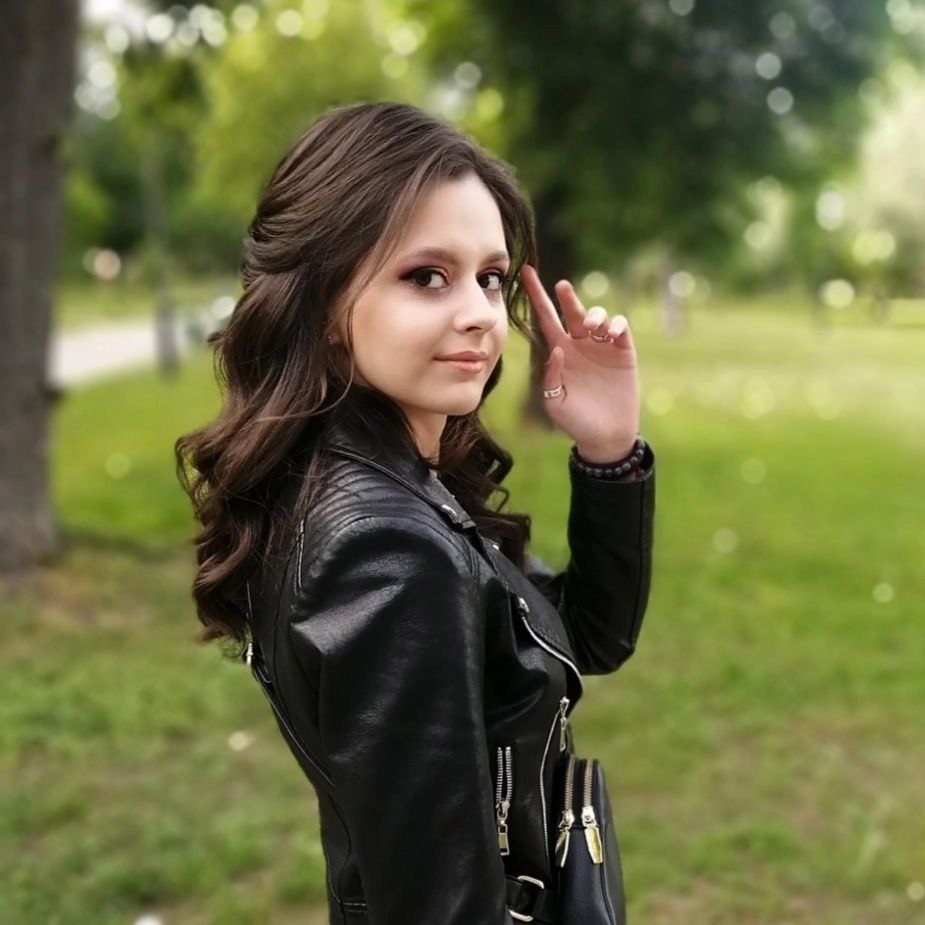
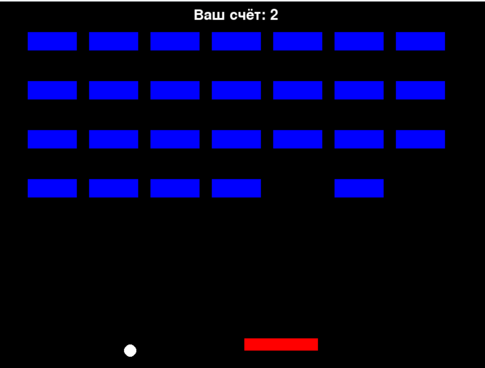
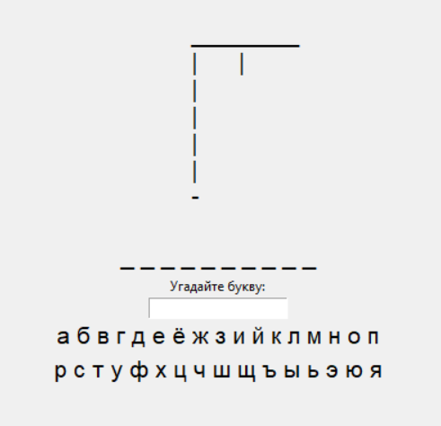
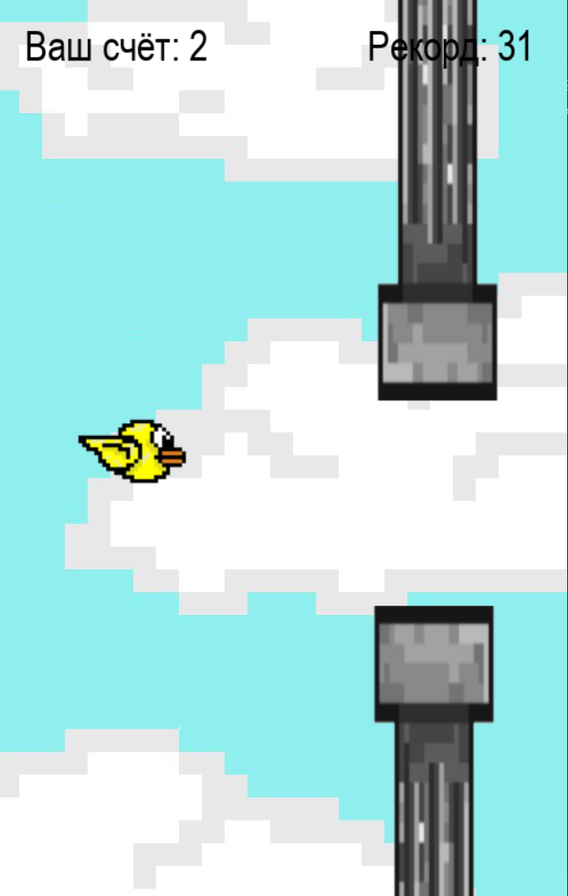
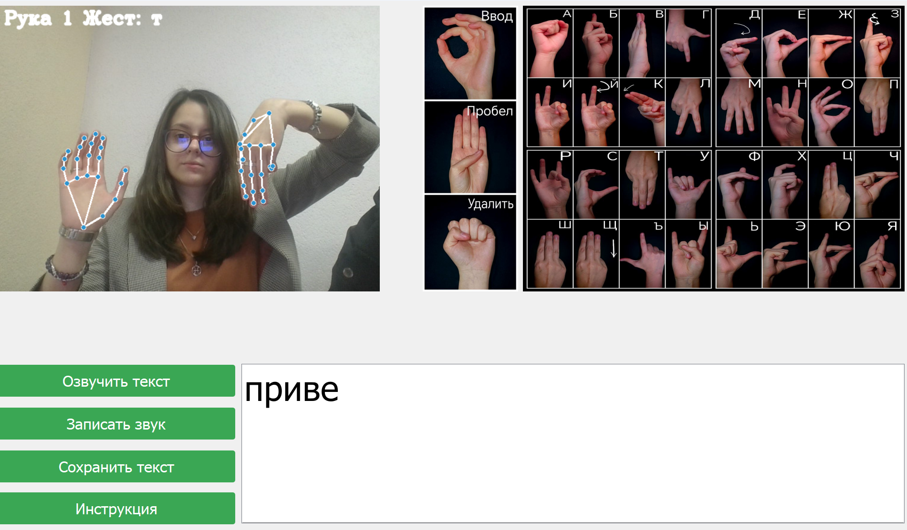

  Голяс Анастасия 

*   **Голяс Анастасия Сергеевна**

*   [Обо мне](#Обо_мне)
*   [Образование](#Образование)
*   [Навыки](#Навыки)
*   [Примеры кода](#Примеры_кода)
*   [Мои проекты](#Мои_проекты)
*   [Курсы и тренинги](#Курсы_и_тренинги)

*   📧 Email: y367152@gmail.com
*   📱 Телефон: +375(44)5588676
*   📍 Беларусь, г. Могилёв

*   
*   
*   
*   

Моё резюме
==========

Обо мне
-------

*   Программист, разработчик "Gestotalk"
*   Поттероман
*   Капитан команды "Интерфейс" инженерно-экономического факультета
*   Игрок команды "Старик Хоттабыч" интеллектуальных игр "Мозгобойня" в г. Лида
*   Игрок команды "Фантастычныя твары" интеллектуальных игр "Мозгобойня" в г. Могилёв
*   Игрок команды "Amigos de Rowling" интеллектуальных игр "Смузи" в г. Могилёв
*   Финалистка конкурса "100 идей для Беларуси"
*   Лауреат "Coding fest-9"

Хочу создавать проекты, которые изменят мир к лучшему.

\*Опыт работы отсутсвует.

Образование
-----------

2023 - настоящее время

### Белорусско-Российский университет, инженерно-экономический факультет, Прикладная математика

2012 - 2023

### ГУО "Средняя школа №12 г. Лиды"

Навыки
------

*   Python
*   Компьютерное зрение
*   HTML/CSS
*   C++
*   Английский язык B2
*   Турецкий язык A1

Примеры кода
------------

### Python (OpenCV)

            import cv2
            
            # Открытие камеры
            cap = cv2.VideoCapture(0)
            
            while True:
                ret, frame = cap.read()
                cv2.imshow('Camera', frame)
                if cv2.waitKey(1) & 0xFF == ord('q'):
                    break
            
            cap.release()
            cv2.destroyAllWindows()
                        

### C++

            #include <iostream>
            using namespace std;
            
            int main() {
                for (int i = 0; i < 4; i++) {
                    for (int number = 1; number <= 10; number++) {
                        cout << number << " ";
                    }
                    cout << endl; 
                }
                return 0;
            }
                        

Мои проекты
-----------

*   Graph programm - программа для работы с графами
*   Solve Riccati - программа для решения уравнений типа Риккати
*   Gestotalk - приложение для перевода языка жестов

Скриншоты некоторых проектов

Арканоид

Аэрохоккей

Виселица

Flappy bird

Gestotalk

Курсы и тренинги
----------------

*   Курс создание чат-ботов на Python от Epam
*   Курс "Computer science" от Epam (в процессе)
*   Курс по HTML/CSS на Stepik (в процессе)
*   Курс повышения квалификации "ИТ-архитектура в управлении предприятием" от СПБПУ Петра Великого (в процессе)

© 2023 Голяс Анастасия. Все права защищены.

